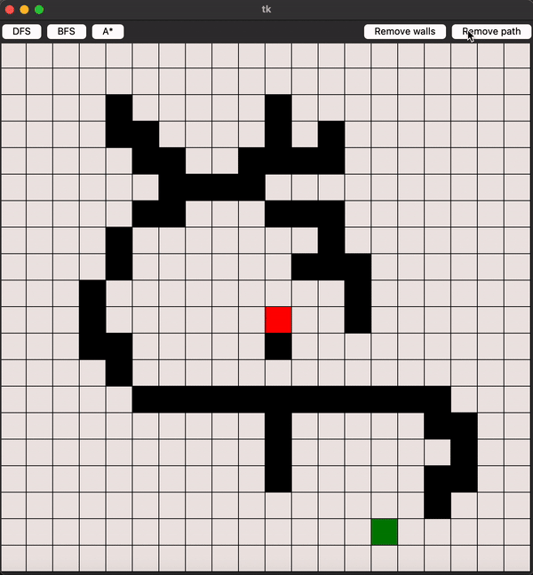
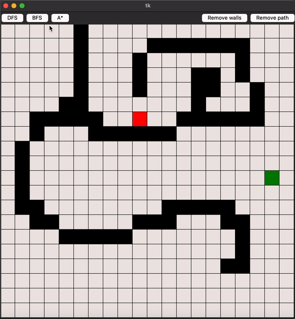

# Path Algo Visualizer Game

This Python application uses Tkinter to create a graphical user interface for a maze game. Users can interact with the maze by adding or removing walls and then visualize how different pathfinding algorithms navigate the maze.

There are 3 algorithms included in the application
* A*: A popular algorithm that finds the shortest path by considering both the cost to reach the goal and the cost to move from the current position.
* BFS (Breadth-First Search): Explores all possible positions at the present depth level before moving on to nodes at the next depth level.
* DFS (Depth-First Search): Explores each branch as far as possible before backtracking.

## Visual Examples
### Breadth-First Search

### A* Algorithm

